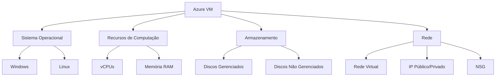

# 💻 Laboratório Azure: Documentação do que Aprendi sobre Máquinas Virtuais 🚀

[](https://azure.microsoft.com/)
[](https://github.com/)
[](https://learn.microsoft.com/pt-br/certifications/azure-fundamentals/)
[](https://github.com/)

<div align="center">
  
</div>

> Este repositório reúne resumos, anotações e conceitos aprendidos sobre máquinas virtuais (VMs) no Microsoft Azure, com foco em documentação técnica clara e estruturada para apoiar estudos e futuras implementações. 📚✨

---

## 📑 Sumário

<details open>
  <summary><b>Clique para expandir/recolher</b></summary>
  
- [📖 Introdução](#-introdução)
- [🎓 O que Aprendi no Azure](#-o-que-aprendi-no-azure)
- [🧠 Conceitos Fundamentais sobre Máquinas Virtuais no Azure](#-conceitos-fundamentais-sobre-máquinas-virtuais-no-azure)
- [🔄 Redundância e Alta Disponibilidade](#-redundância-e-alta-disponibilidade)
- [📊 SLA (Service Level Agreement) e Disponibilidade](#-sla-service-level-agreement-e-disponibilidade)
- [⚖️ Tamanhos, Preços e Escalabilidade](#️-tamanhos-preços-e-escalabilidade)
- [💾 Backups e Snapshots](#-backups-e-snapshots)
- [🔐 Acesso Seguro com Azure Bastion](#-acesso-seguro-com-azure-bastion)
- [📈 Monitoramento com Azure Monitor](#-monitoramento-com-azure-monitor)
- [💡 Dicas e Boas Práticas](#-dicas-e-boas-práticas)
- [☁️ Aprendizados no Microsoft Azure – Módulo Prático](#️-aprendizados-no-microsoft-azure--módulo-prático)
- [🛠️ Gerenciamento de Recursos no Azure](#️-gerenciamento-de-recursos-no-azure)
- [📦 Azure Blob Storage](#-azure-blob-storage)
- [🔍 Azure AI Search](#-azure-ai-search)
- [🧑‍💻 Aprendizados sobre IA Generativa Responsável no Azure](#-aprendizados-sobre-ia-generativa-responsável-no-azure)
- [🛠 Passos Práticos na Criação de Recursos no Azure](#-passos-práticos-na-criação-de-recursos-no-azure)
- [📞 Contato](#-contato)
- [📚 Referências](#-referências)
</details>

---

## 📖 Introdução

<div align="center">
  
</div>

> As máquinas virtuais do Azure são recursos de computação sob demanda que oferecem flexibilidade para criar ambientes virtuais com controle total sobre o sistema operacional e software instalado, sem a necessidade de adquirir hardware físico.

### 🌟 Principais Usos

- **Desenvolvimento e Teste** - Ambientes isolados para desenvolvimento e testes
- **Hospedagem de Aplicativos** - Infraestrutura escalável para aplicações na nuvem
- **Extensão de Datacenters** - Integração híbrida com infraestrutura local
- **Recuperação de Desastres** - Soluções de backup e continuidade de negócios

<div align="center">
  <table>
    <tr>
      <td align="center">☁️</td>
      <td align="center">⚙️</td>
      <td align="center">🔒</td>
      <td align="center">📊</td>
    </tr>
    <tr>
      <td align="center">Nuvem</td>
      <td align="center">Configurável</td>
      <td align="center">Seguro</td>
      <td align="center">Escalável</td>
    </tr>
  </table>
</div>

---

## 🎓 O que Aprendi no Azure

> Este repositório documenta meu aprendizado sobre máquinas virtuais no Azure, incluindo conceitos fundamentais, configurações, boas práticas e implementações práticas. Os conhecimentos adquiridos fazem parte do curso AZ-900 (Microsoft Azure Fundamentals).

<div align="center">
  
</div>

---

## 🧠 Conceitos Fundamentais sobre Máquinas Virtuais no Azure

<div align="center">
  
</div>

### ✅ Características Principais

- **Ambientes sob demanda e escaláveis**: As VMs permitem criar rapidamente computadores virtuais com configurações específicas para atender às necessidades de processamento, memória e armazenamento.

- **Gerenciamento**: Embora o Azure cuide da virtualização e do hardware subjacente, o usuário é responsável por configurar, corrigir e instalar o software dentro da VM.

- **Regiões e localizações**: A localização da VM determina onde os discos virtuais são armazenados e pode impactar latência e conformidade. O Azure oferece múltiplas regiões globais para escolha.

- **Autenticação**: É possível usar nome de usuário e senha ou chaves SSH para acesso seguro às VMs.

- **Discos gerenciados**: O Azure gerencia automaticamente o armazenamento dos discos, facilitando escalabilidade e manutenção.



---

## 🔄 Redundância e Alta Disponibilidade

> A redundância no Azure garante que seus serviços permaneçam disponíveis mesmo em caso de falhas de hardware ou desastres regionais.

### 🏢 Zonas de Disponibilidade

Áreas fisicamente separadas dentro de uma mesma região que garantem alta disponibilidade, com conectividade garantida de 99,99% ao implantar múltiplas instâncias em zonas diferentes.

### 🔄 Conjuntos de Dimensionamento

Permitem criar grupos de VMs com balanceamento de carga e escalabilidade automática, garantindo alta disponibilidade e gerenciamento centralizado.

### 💾 Tipos de Redundância de Armazenamento

<div align="center">

| Tipo | Descrição | Indicação | Ícone |
|------|-----------|-----------|-------|
| **LRS** (Local Redundant Storage) | Proteção contra falhas locais de hardware | Cenários não críticos | 🏠 |
| **GRS** (Geo Redundant Storage) | Replicação geográfica para proteção contra falhas regionais | Backup | 🌎 |
| **ZRS** (Zone Redundant Storage) | Proteção contra falhas em datacenters | Alta disponibilidade | 🏢 |
| **GZRS** (Geo-Zone Redundant Storage) | Combinação de redundância geográfica e por zona | Dados críticos | 🌐 |

</div>

<div align="center">
  
</div>

---

## 📊 SLA (Service Level Agreement) e Disponibilidade

> O SLA do Azure define os níveis de disponibilidade e o tempo máximo de inatividade permitido para as VMs, com diferentes níveis que impactam diretamente na confiabilidade do serviço.

<div align="center">

| SLA | Inatividade Semanal | Inatividade Mensal | Inatividade Anual | Nível |
|-----|---------------------|--------------------|--------------------|-------|
| 99% | 1,68 hora ⏳ | 7,2 horas ⏳ | 3,65 dias ⏳ | ⭐ |
| 99,9% | 10,1 minutos ⏳ | 43,2 minutos ⏳ | 8,76 horas ⏳ | ⭐⭐ |
| 99,95% | 5 minutos ⏳ | 21,6 minutos ⏳ | 4,38 horas ⏳ | ⭐⭐⭐ |
| 99,99% | 1,01 minuto ⏳ | 4,32 minutos ⏳ | 52,56 minutos ⏳ | ⭐⭐⭐⭐ |
| 99,999% | 6 segundos ⏳ | 25,9 segundos ⏳ | 5,26 minutos ⏳ | ⭐⭐⭐⭐⭐ |

</div>

> **Dica:** Para cargas de trabalho críticas, considere implementar VMs em zonas de disponibilidade diferentes para alcançar um SLA de 99,99%.

---

## ⚖️ Tamanhos, Preços e Escalabilidade

### 📏 Tamanhos

O tamanho da VM define recursos como núcleos de CPU, memória, armazenamento e largura de banda. Deve ser escolhido conforme a carga de trabalho desejada.

<details>
  <summary><b>Séries de VMs Populares</b></summary>
  
  - **Série B** - Econômica, para cargas de trabalho com picos ocasionais
  - **Série D** - Propósito geral, equilibrada em CPU e memória
  - **Série F** - Otimizada para CPU, ideal para servidores web
  - **Série E** - Otimizada para memória, ideal para bancos de dados
  - **Série N** - Otimizada para GPU, ideal para machine learning
</details>

### 💰 Preços

Cobrança por hora baseada no tamanho da VM e sistema operacional; minutos parciais são cobrados proporcionalmente. O custo pode ser otimizado com benefícios como o Azure Hybrid Benefit.

### 📈 Escalabilidade

É possível escalar verticalmente (tamanho da VM) ou horizontalmente (número de VMs) para atender demandas variáveis, usando conjuntos de dimensionamento e políticas de autoescalonamento.

<div align="center">
  
</div>

### ⚠️ Limites

Por padrão, há limites de núcleos por assinatura e região, que podem ser aumentados mediante solicitação.

---

## 💾 Backups e Snapshots

### 🔄 Backups

O Azure Backup permite criar cópias de segurança automatizadas das VMs, armazenadas em um Recovery Services Vault. Os backups podem ser agendados e restaurados em caso de falhas ou exclusões acidentais.

### 📸 Snapshots

Imagens instantâneas dos discos de uma VM, úteis para criar pontos de restauração rápidos ou clonar VMs. Snapshots são armazenados como blobs no Azure e podem ser usados para recuperação ou replicação.

### ✅ Boas Práticas

- Configure políticas de backup com retenção adequada para equilibrar custo e proteção.
- Use snapshots para testes ou mudanças temporárias, mas prefira backups para recuperação de longo prazo.

<div align="center">
  
</div>

---

## 🔐 Acesso Seguro com Azure Bastion

> O Azure Bastion fornece acesso RDP e SSH seguro às suas VMs diretamente pelo portal Azure, sem expor portas públicas.

<div align="center">
  
</div>

### 🌟 Vantagens

- Conexão via navegador ou Azure Portal, sem necessidade de clientes adicionais.
- Integração com redes virtuais para maior controle.
- Proteção contra ataques de força bruta e exposição de portas.
- Suporte a autenticação multifator.

### ⚙️ Configuração

Associar o Bastion a uma VNET e configurar regras de acesso via NSG (Network Security Group).

```bash
# Exemplo de comando para criar um Azure Bastion
az network bastion create \
  --name MyBastion \
  --public-ip-address MyBastionPIP \
  --resource-group MyResourceGroup \
  --vnet-name MyVNet \
  --location eastus
```

---

## 📈 Monitoramento com Azure Monitor

> O Azure Monitor permite coletar, analisar e visualizar métricas e logs das VMs, facilitando o diagnóstico de problemas e a otimização de desempenho.

<div align="center">
  
</div>

### 📊 Funcionalidades

- Coleta de métricas como uso de CPU, memória e disco.
- Configuração de alertas para eventos críticos, como alta utilização de recursos.
- Integração com Log Analytics para consultas detalhadas.
- Visualização de dados em dashboards personalizados.

### ✅ Boas Práticas

- Habilite o agente do Azure Monitor nas VMs para coleta de dados detalhada.
- Crie dashboards personalizados para acompanhar KPIs específicos.
- Configure alertas proativos para evitar problemas antes que afetem os usuários.

```kusto
// Exemplo de consulta KQL para monitorar uso de CPU
Perf
| where ObjectName == "Processor" and CounterName == "% Processor Time"
| where TimeGenerated > ago(1h)
| summarize avg(CounterValue) by Computer, bin(TimeGenerated, 5m)
| render timechart
```

---

## 💡 Dicas e Boas Práticas

<div align="center">
  <table>
    <tr>
      <th>Dica</th>
      <th>Descrição</th>
      <th>Ícone</th>
    </tr>
    <tr>
      <td>Escolha da região</td>
      <td>Selecione a região mais próxima dos usuários para minimizar latência</td>
      <td>🌐</td>
    </tr>
    <tr>
      <td>Alta disponibilidade</td>
      <td>Utilize zonas de disponibilidade para cargas de trabalho críticas</td>
      <td>🏢</td>
    </tr>
    <tr>
      <td>Backups regulares</td>
      <td>Implemente backups regulares e teste restaurações para garantir recuperação</td>
      <td>💾</td>
    </tr>
    <tr>
      <td>Acesso seguro</td>
      <td>Use Azure Bastion para acesso seguro, evitando portas públicas</td>
      <td>🔐</td>
    </tr>
    <tr>
      <td>Monitoramento</td>
      <td>Monitore o desempenho com Azure Monitor e configure alertas proativos</td>
      <td>📈</td>
    </tr>
    <tr>
      <td>Princípio do menor privilégio</td>
      <td>Aplique o princípio do menor privilégio no IAM para maior segurança</td>
      <td>👮</td>
    </tr>
  </table>
</div>

---

## ☁️ Aprendizados no Microsoft Azure – Módulo Prático

<div align="center">
  
</div>

### 📘 Sobre

Neste módulo prático do curso AZ-900 (Microsoft Azure Fundamentals), adquiri conhecimentos essenciais sobre o uso do Azure para gerenciamento de recursos em nuvem. Abaixo estão os principais tópicos que estudei e pratiquei na plataforma.

### 🧠 Habilidades e Conceitos Aprendidos

<details>
  <summary><b>📦 Grupo de Recursos</b></summary>
  
  - Criação de Resource Groups para organizar e gerenciar recursos relacionados a uma mesma solução.
  - Escolha de região e associação com assinatura adequada.
  - Aplicação de tags para organização e controle de custos.
</details>

<details>
  <summary><b>📜 Log de Atividades</b></summary>
  
  - Monitoramento de ações e eventos dentro do Azure.
  - Verificação de quando e por quem um recurso foi criado, alterado ou excluído.
  - Configuração de alertas para atividades específicas.
</details>

<details>
  <summary><b>👥 IAM - Controle de Acesso</b></summary>
  
  - Uso do IAM (Identity and Access Management) para:
    - Adicionar e remover usuários.
    - Gerenciar permissões e funções (RBAC – Role-Based Access Control).
    - Implementar o princípio do menor privilégio.
</details>

<details>
  <summary><b>🔒 Bloqueios</b></summary>
  
  - Aplicação de Locks (Read-only e Delete) para evitar exclusões ou modificações acidentais de recursos.
  - Estratégias para proteção de recursos críticos.
</details>

<details>
  <summary><b>⚙️ Eventos</b></summary>
  
  - Utilização de Eventos para criar automatizações com base em ações dentro do ambiente (ex.: criação de recurso).
  - Integração com Logic Apps e Functions para workflows automatizados.
</details>

<details>
  <summary><b>🌐 Rede Virtual (VNET)</b></summary>
  
  - Criação de VNETs (Virtual Networks) para organização de redes privadas no Azure.
  - Definição de endereçamento IP para os ambientes virtuais.
  - Configuração de sub-redes e grupos de segurança.
</details>

### 🧰 Tecnologias Utilizadas

<div align="center">
  <table>
    <tr>
      <td align="center"></td>
      <td align="center"></td>
      <td align="center"></td>
      <td align="center"></td>
    </tr>
    <tr>
      <td align="center">Microsoft Azure</td>
      <td align="center">Azure Portal</td>
      <td align="center">IAM</td>
      <td align="center">Resource Manager</td>
    </tr>
  </table>
</div>

### 🏁 Conclusão

Esse aprendizado foi fundamental para entender como gerenciar a infraestrutura em nuvem de forma segura, organizada e automatizada. Agora estou preparado para criar ambientes cloud com boas práticas e maior controle.

### 📎 Links Úteis

- [Portal do Azure](https://portal.azure.com)
- [Documentação Oficial do Azure](https://docs.microsoft.com/azure)
- [Curso AZ-900 na DIO](https://dio.me)

---

## 🛠️ Gerenciamento de Recursos no Azure

<div align="center">
  
</div>

### 📋 Listagem e Filtros

Aprendi a listar e filtrar recursos no Azure Portal, como serviços de pesquisa (`azuresearchmod5`), contas de armazenamento (`storageacc11`) e contas multi-serviços (`instancename01`).

### 📊 Detalhes dos Recursos

- **Grupo de Recursos**: `AZ-900_LAB_DIO`
- **Localização**: `East US`
- **Assinatura**: `Azure subscription 1`

### 🏷️ Organização

Utilizei filtros para agrupar recursos por tipo, localização e assinatura, facilitando a gestão.

```bash
# Exemplo de comando para listar recursos por grupo
az resource list --resource-group AZ-900_LAB_DIO --output table
```

---

## 📦 Azure Blob Storage

<div align="center">
  
</div>

### 🗃️ Contêineres

Trabalhei com a conta de armazenamento `storageacc11`, explorando a criação e gerenciamento de contêineres.

### ⚙️ Gerenciamento de Contêineres

- Criei contêineres como `slogs` e `coffeereviews`.
- Configurei níveis de acesso (público, privado, contêiner) e verifiquei estados de conexão.
- Acompanhei a última modificação dos contêineres (ex.: `18/05/2025`).

### 🔄 Uso Prático

Entendi como o Blob Storage pode ser usado para armazenar dados não estruturados, como logs e arquivos de texto.

```bash
# Exemplo de comando para criar um contêiner
az storage container create \
  --name coffeereviews \
  --account-name storageacc11 \
  --public-access blob
```

---

## 🔍 Azure AI Search

<div align="center">
  
</div>

### 🔎 Serviço de Pesquisa

Configurei e explorei o `azuresearchmod4`, um serviço de pesquisa baseado em IA.

### 📚 Índices e Pesquisa

- Criei um índice chamado `coffee-index`.
- Realizei consultas específicas, como `search=locations:'Chicago'`, para buscar dados com base em critérios.

### ⚙️ Funcionalidades

- Naveguei pelo **Search Explorer** para testar consultas.
- Aprendi sobre a integração do Azure AI Search com outros serviços para criar experiências de busca com texto completo e ranqueamento semântico.

```json
// Exemplo de consulta no Search Explorer
{
  "search": "locations:'Chicago'",
  "select": "id, name, locations, reviews",
  "count": true
}
```

---

## 🧑‍💻 Aprendizados sobre IA Generativa Responsável no Azure

<div align="center">
  
</div>

### 🧠 Fases para Desenvolver e Implementar um Plano de IA Responsável

Ao planejar uma solução de IA generativa responsável, aprendi que o processo é dividido em quatro fases principais, que garantem a segurança, a ética e a eficiência da solução:

<details>
  <summary><b>1. Identificar</b></summary>
  
  **Objetivo**: Reconhecer possíveis danos relevantes que podem ser causados pela solução planejada.

  **Exemplo**: Analisar riscos como viés, discriminação, privacidade ou uso indevido dos dados.
  - Identificar riscos e impactos potenciais antes do desenvolvimento da solução.
</details>

<details>
  <summary><b>2. Medida</b></summary>
  
  **Objetivo**: Medir a presença desses danos nas saídas geradas pela solução de IA.

  **Exemplo**: Avaliar se as respostas do modelo apresentam vieses ou informações inadequadas.
  - Avaliar e monitorar os resultados do modelo para detectar possíveis danos.
</details>

<details>
  <summary><b>3. Mitigar</b></summary>
  
  **Objetivo**: Implementar estratégias em várias camadas para minimizar a presença de danos.

  **Exemplo**: Utilizar filtros de conteúdo, ajustar prompts ou implementar revisão humana.
  - Desenvolver e implementar estratégias para reduzir riscos identificados.
</details>

<details>
  <summary><b>4. Operar</b></summary>
  
  **Objetivo**: Manter a solução funcionando de forma responsável ao longo do tempo.

  **Exemplo**: Monitorar continuamente o desempenho, coletar feedback e fazer ajustes conforme necessário.
  - Garantir que a solução continue operando de forma ética e responsável.
</details>

---

## 🛠 Passos Práticos na Criação de Recursos no Azure

<div align="center">
  
</div>

A seguir, documentei os passos práticos realizados no Azure Portal para criar uma máquina virtual, um pool de hosts e um aplicativo de funções, com foco nas configurações de redundância, armazenamento e diagnóstico.

### 🖥️ Criação de uma Máquina Virtual

<details>
  <summary><b>Passo a passo detalhado</b></summary>
  
  1. **Seleção da assinatura e grupo de recursos**: Escolhi a assinatura "Azure subscription 1" e criei um grupo de recursos chamado "AZ-900_LAB_DIO" para organizar os recursos.
  
  2. **Configuração básica da VM**: Nomeei a VM como "machine01", selecionei a região "(US) East US 2", e optei por nenhuma redundância de infraestrutura (indicado como "Nenhuma redundância infraestrutura necessária").
  
  3. **Zona de disponibilidade**: Mantive a configuração padrão "Nenhuma" para zona de disponibilidade, já que o cenário não exigia alta disponibilidade.
  
  4. **Imagem e tamanho da VM**: Escolhi a imagem "Ubuntu Server 24.04 LTS - x64 Gen2" e o tamanho "Standard B1s" (1 vCPU, 1 GiB de memória).
  
  5. **Arquitetura**: Selecionei a arquitetura "x64" para compatibilidade com a imagem escolhida.
  
  6. **Outras configurações**: Habilitei o uso de discos SSD Premium para armazenamento e deixei as opções de segurança e rede com os valores padrão (ex.: portas públicas RDP abertas, mas com alerta para usar o Azure Bastion para maior segurança).
</details>

### 👥 Criação de um Pool de Hosts

<details>
  <summary><b>Passo a passo detalhado</b></summary>
  
  1. **Assinatura e localização**: Utilizei a mesma assinatura "Azure subscription 1" e escolhi a localização "East US".
  
  2. **Grupo de recursos**: Mantive o grupo de recursos "AZ-900_LAB_DIO" para centralizar os recursos do laboratório.
  
  3. **Ambiente de validação**: Habilitei o ambiente de validação para testes, selecionando "Sim".
  
  4. **Tipo de grupo de aplicativos**: Escolhi "Área de Trabalho" como tipo de grupo de aplicativos preferencial.
  
  5. **Tipo de pool de hosts**: Selecionei o tipo padrão (não especificado como "agrupado" ou "pessoal").
</details>

### ⚡ Criação de um Aplicativo de Funções

<details>
  <summary><b>Passo a passo detalhado</b></summary>
  
  1. **Configuração inicial**: Criei um aplicativo de funções com suporte a "Armazenamento de Blobs, Filas e Tabelas", associando-o a uma nova conta de armazenamento chamada "testeavalgroup59a".
  
  2. **Configurações de diagnóstico**: Optei por não definir configurações de diagnóstico inicialmente, mantendo a opção "Não definir as configurações de diagnóstico agora".
</details>

### 🧠 Conceitos Revisados Durante o Processo

- **Tipos de recursos**: Aprendi sobre tipos de computação, instâncias de contêiner, máquinas virtuais e funções no Azure.
- **Hospedagem de aplicativos**: Entendi as opções de hospedagem, como Aplicativos Web do Azure, contêineres e máquinas virtuais.
- **Redes e conectividade**: Revisei conceitos de redes virtuais, sub-redes, emparelhamento, DNS, Gateway de VPN e ExpressRoute.

---

## 📞 Contato

<div align="center">
  <a href="https://github.com/andreyrosa">
    
  </a>
  <a href="www.linkedin.com/in/andrey-rosa-887b8733a">
    
  </a>
  <a href="mailto:andrey19rosa951@gmail.com">
    
  </a>
</div>

---

## 📚 Referências

- [Documentação Oficial do Azure](https://docs.microsoft.com/azure)
- [Microsoft Learn - AZ-900](https://learn.microsoft.com/pt-br/certifications/azure-fundamentals/)
- [Curso AZ-900 na DIO](https://dio.me)
- [Azure Architecture Center](https://learn.microsoft.com/pt-br/azure/architecture/)
- [Azure Pricing Calculator](https://azure.microsoft.com/pt-br/pricing/calculator/)

---

<div align="center">
  <p>
    <a href="https://azure.microsoft.com">
      
    </a>
  </p>
  
  <p>
    <small>Desenvolvido com ❤️ como parte do meu aprendizado em Azure</small>
  </p>
</div>
